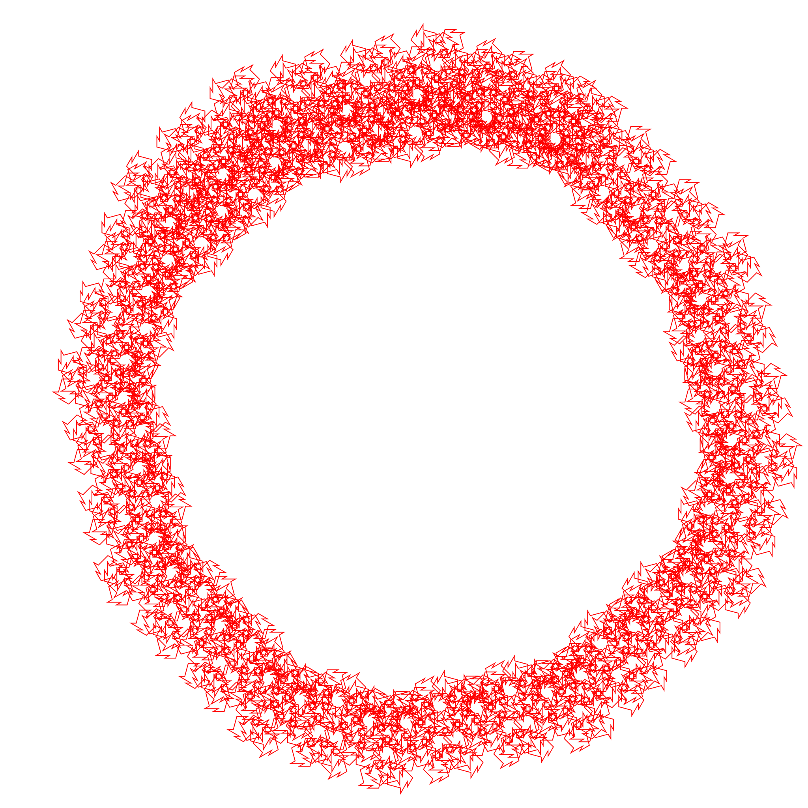

# Lsystem

# Gramática:

alfabeto: E, D, C, L, x
inicio: ELCxCLD
regras de produção: L > ECDC
                    C > EEx
                    x > ELD

# Representam:
E - virar a esquerda 75°
D - virar a direita 75°
C - andar pra frente 20px
L - andar pra frente 50px
x - nada, para regra de produção

# Formatação da entrada:
ELCxCLD   // inicio
9         // numero de iterações
L>CELDC   //regras de produção
x>ELDDL   
E>CDDCEELDD

#Saida:

